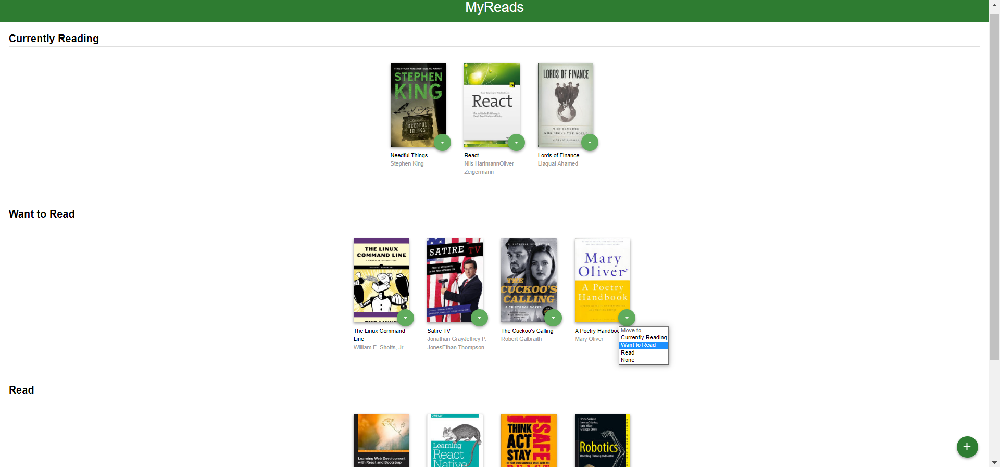
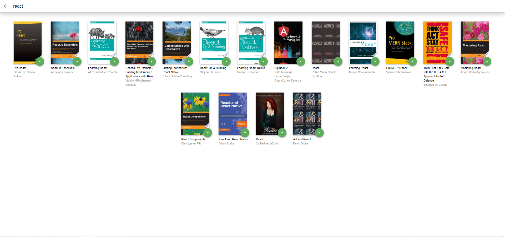

## Table of Contents

- [Overview](#overview)
- [How to run the project](#how-to-run-the-project)
- [Backend Server](#backend-server)
- [App Functionality](#app-functionality)
- [Important](#important)
- [Screenshots](#screenshots)

## Overview

In the MyReads project, I created a bookshelf app that allows the users to select and put books they have read, are currently reading, or want to read in the suitable shelf. Also the app provides a search page to find books and categorise it.

## How to run the project

To run the project, download or clone the repository in your computer.

and follow the instructions below.

In the repository folder:

- install all project dependencies with

        npm install

- start the development server with

        npm start

## Backend Server

To simplify your development process, we've provided a backend server for you to develop against. The provided file [`BooksAPI.js`](src/BooksAPI.js) contains the methods you will need to perform necessary operations on the backend:

- [`getAll`](#getall)
- [`update`](#update)
- [`search`](#search)

## App Functionality

The main page displays a list of shelves, each of it contains a number of books.
These shelves are:

- Currently Reading
- Want to Read
- Read

Each book has a dropdown menu to make the user able to move it between shelves.

The search page has a text input field to find books.

## Important

The backend API uses a fixed set of cached search results and is limited to a particular set of search terms, which can be found in [SEARCH_TERMS.md](SEARCH_TERMS.md). That list of terms are the _only_ terms that will work with the backend, so don't be surprised if your searches for Basket Weaving or Bubble Wrap don't come back with any results.

## Screenshots

- A screenshot of the app main page:
  
- A screenshot of the app search page:
  
